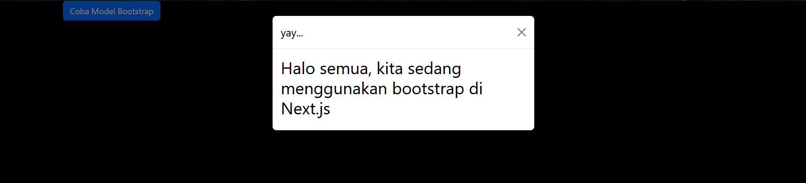
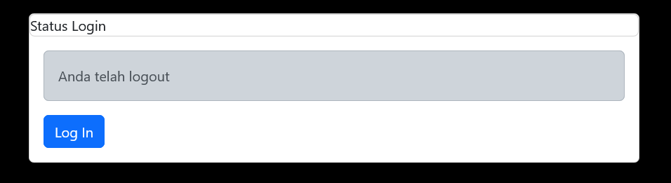
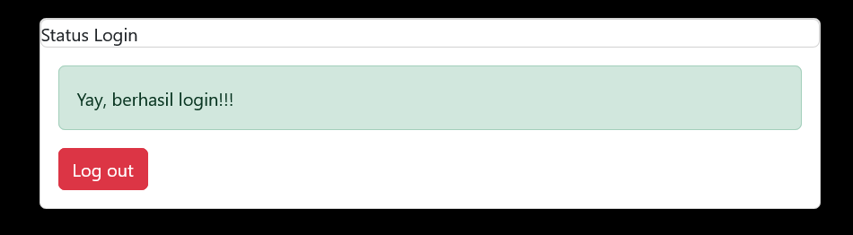

## Laporan Praktikum

|  | Pemrograman Berbasis Framework 2024 |
|--|--|
| NIM |  2141720156|
| Nama |  Versacitta Feodora Ramadhani |
| Kelas | TI - 3I |

### Practicum 1
 
The index page now have a button that will show a modal layout with the corresponding message. It is a component unique to Bootstrap, which means we could use Bootstrap css and js into React and not just strictly Tailwind-CSS
 

### Practicum 2
 
 
A new button will appear, in which we could switch the current state between login and logout, and will change the text above the button according to the state. 
1. After clicking 'Login', the state remains even after several refresh
2. `parse()` is used to convert the HTML string into a React element. While not using it will make the code inside becomes normal HTML string and the application run as normal. having React element will make it easier to call it again in another place.
 
