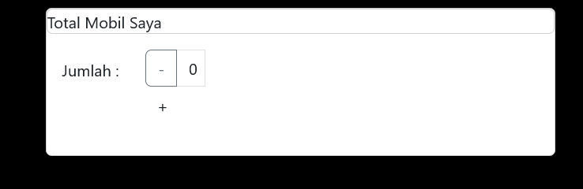

## Laporan Praktikum

|  | Pemrograman Berbasis Framework 2024 |
|--|--|
| NIM |  2141720156|
| Nama |  Versacitta Feodora Ramadhani |
| Kelas | TI - 3I |

### Practicum 1
 
The index page now have a button that will show a modal layout with the corresponding message. It is a component unique to Bootstrap, which means we could use Bootstrap css and js into React and not just strictly Tailwind-CSS
 

### Practicum 2
 
 
A new button will appear, in which we could switch the current state between login and logout, and will change the text above the button according to the state. 
1. After clicking 'Login', the state remains even after several refresh
2. `parse()` is used to convert the HTML string into a React element. While not using it will make the code inside becomes normal HTML string and the application run as normal. having React element will make it easier to call it again in another place.
 

### Practicum 3
 
A counter will appear, in which we could increase or reduce the number on said bar.
 

### Tugas
1. What is the use of this code `import { useEffect } from "react";` in the file `pages/_app.tsx`? explain 
The purpose of this code is to enable the certain tsx file to be able to access useEffect function from React module. Specifically, the function will be passed and be called later after performing DOM updates. 

2. If in the `pages/_app.tsx` file we don't use useEffect (removing line 3, and lines 9-11), what will happen? 
There won't be any noticable effect when useEffect function is removed. However, if there is a certain functionality that requires change in DOM update and especially relies on bootstrap features, it won't be executed properly. 

3. Why does it have to be changed to `className` when writing the html tag for a class in react/nextjs? 
This is required due to how JSX works. The extension will conflict with syntax `class` from JavaScript and thus is given different name. 

4. Can the store function in nextjs store many redux reducers? 
It is possible to store multiple reducers, tipically within `store.js` file as its container. 

5. Explain the usage of the `store.js` file! 
As stated above, `store.js` is used to store multiplpe redux reducers. The file is also used to combine several reducers into one root, and even able to connect them to middleware if needed. 

6. In the `pages/login.tsx` file, what does this code mean? `const { isLogin } = useSelector((state) => state.auth);` 
The code is used to store the state of whether user is logged in or not, by using Redux's `useSelector` function to retrieve such state from `store.js`--which is auth section. Depending on the value, it will change the behavior in the login page 

7. In the pages/counter.tsx file, what does this code mean? `const { totalCounter } = useSelector((state) => state.counter);` 
The code is used to store the state of counter number by using Redux's `useSelector` function to retrieve such state from `store.js`--which is auth section. It will change depending on what user does to the counter page. 